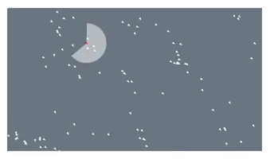

# Boids || Flocking

Simulating the three behaviours of flocking:

The boids have a limited perception radius, allowing them to only see what's inside it.

- Separation - boids steer away from any nearby boids within its perception range.
- Cohesion - boids steer towards the center of nearby flock within its perception range.
- Alignment - boids steer towards the average direction of any nearby flock within its perception range.

